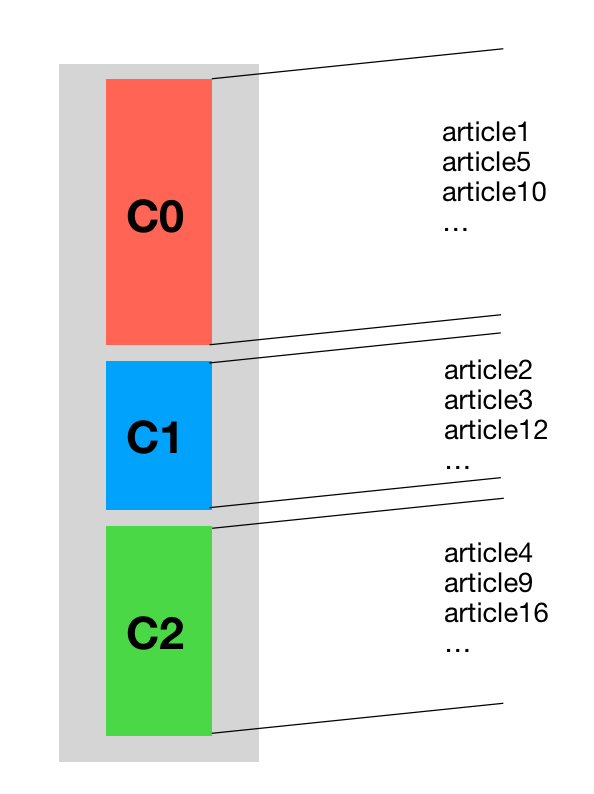
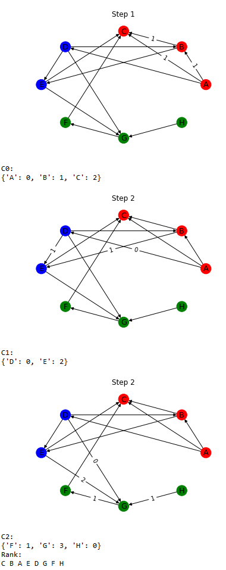

# Homework 5 - Visit the Wikipedia hyperlinks graph!
In this assignment we perform an analysis of the Wikipedia Hyperlink graph. In particular, given extra information about the categories to which an article belongs to, we are curious to rank the articles according to some criteria. 

For this purpose we use the Wikipedia graph released by the SNAP group.

## Before starting
Here you find the list of tasks you need to perform before running the analysis.

1.  Download  [Wikicat hyperlink graph](https://drive.google.com/file/d/1ghPJ4g6XMCUDFQ2JPqAVveLyytG8gBfL/view?usp=sharing).  It is a reduced version of the one you find on SNAP. Every row is an edge, the two elements are the nodes (source and destination).
2.  From [this](https://snap.stanford.edu/data/wiki-topcats.html) page download:
	-  `wiki-topcats-categories.txt.gz`
	-  `wiki-topcats-page-names.txt.gz`

Note that there are some categories that we have removed from the graph; more precisely, you **must take into account all the categories that has a number of articles greater than 3500.**

## VERY VERY IMPORTANT

**!!!Read the entire homework before coding anything!!!**

## General notes

You will notice that one article might belong to a single category or multiple ones. In the case it belongs to more than one:

* If the article belongs to the input category (we will talk about this in RQ2) it belongs to that one.
* Otherwise, the category of the article will correspond, among the categories it belongs to, to the closest to the input category.

__All the algorithms__, must be implement from scratch, with the exception of the algorithm that computes the induced subgraph.

## Research questions

**[RQ1]** Build the graph , where *V* is the set of articles and *E* the hyperlinks among them, and provide its basic information:
 
- If it is direct or not
- The number of nodes
- The number of edges 
- The average node degree. Is the graph dense?

**[RQ2]** Given a category  as input we want to rank all of the nodes in *V* according to the following criteria:
	
* Obtain a *block-ranking*, where the blocks are represented by the categories. In particular, we want:

	
Each category  corresponds to a list of nodes. 

The first category of the rank, , always corresponds to the input category. The order of the remaining categories is given by:

The lower is the distance from , the higher is the  position in the rank.  is the set of all the possible shortest paths between the nodes of   and . Moreover, the length of a path is given by the sum of the weights of the edges it is composed by.

* Once you obtain the  vector, you want to sort the nodes in each category. The way you should sort them is explained by this example:

	*	Suppose the categories order, given from the previous point, is 

__[STEP1]__ Compute subgraph induced by . For each node compute the sum of the weigths of the in-edges.

 

__[STEP2]__ Extend the graph to the nodes that belong to . Thus, for each article in  compute the score as before. __Note__ that the in-edges coming from the previous category, , have as weights the score of the node that sends the edge.

__[STEP3]__ Repeat Step2 up to the last category of the ranking. In the last step of the example you clearly see the weight update of the edge coming from node *E*.
	

# Submitting the homework

## When?

Homework 5 is due on [23rd December 2018 - 23:59:59](http://aris.me/index.php/data-mining-ds-2018). Any homework submitted after the deadline will be subjected to a penalisation with the following schema:

|   Delay  | Penalisation |
|:--------:|:------------:|
|  1 day |     -0.5     |
| 2 days |      -1      |
| 3 days |      -2      |
| 4 days |      -3      |
| 5 days |      -4      |
 
If you have particular problems to respect the deadline, please contact Aris directly (putting @Cristina in cc) and explain your situation clearly mention your working group.
The maximum score you can get is 5.

## What?
The content of the repository is up to you. The mandatory files are:

* `README.md`: a Markdown file that explains the content of your repository. This is an [example](https://github.com/CriMenghini/Wikipedia/tree/master/Mention). It is important that for each file/folder you say what it contains. [Here](https://github.com/adam-p/markdown-here/wiki/Markdown-Cheatsheet) a cheatsheet to use Markdown.
* `Homework_5.ipynb`: a tidy Notebook where you put the code and the comments of your pipeline. Here an [example](https://github.com/CriMenghini/ADA_Homeworks/blob/master/Homework_2/Hw_2.ipynb) of what it should look like.
    - In general, for the sake of the tidiness of the Notebook, you are encouraged to save your functions in external .py files that you [import](https://www.programiz.com/python-programming/modules) in the notebook.
    - Upload on GitHub the notebook with the cells already run
    - It might be possible that you do not see some plots. For this reason, we suggest you to put in the `README.md` a link that you create [here](http://nbviewer.jupyter.org/) just copying and paste the url of your notebook on GitHub.

It __must not__ contain:

* The datasets you used (thus you should clearly state in the readme what dataset you used, if any not in the homework description). That's because git allows you to push only dataset smaller of a max size. [Here](https://medium.com/@haydar_ai/learning-how-to-git-ignoring-files-and-folders-using-gitignore-177556afdbe3) a good Medium's post that tells you how to deal with files/directories you do not want to push on GitHub.

## Forms
- [Github Repository Form](https://goo.gl/forms/9bqQKaUEIixoD0rx1)
- Group Review Form [Available after the deadline]
- Peer Review Form [Available after the deadline]

